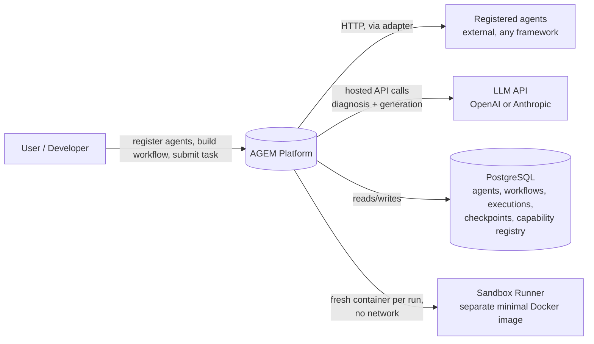
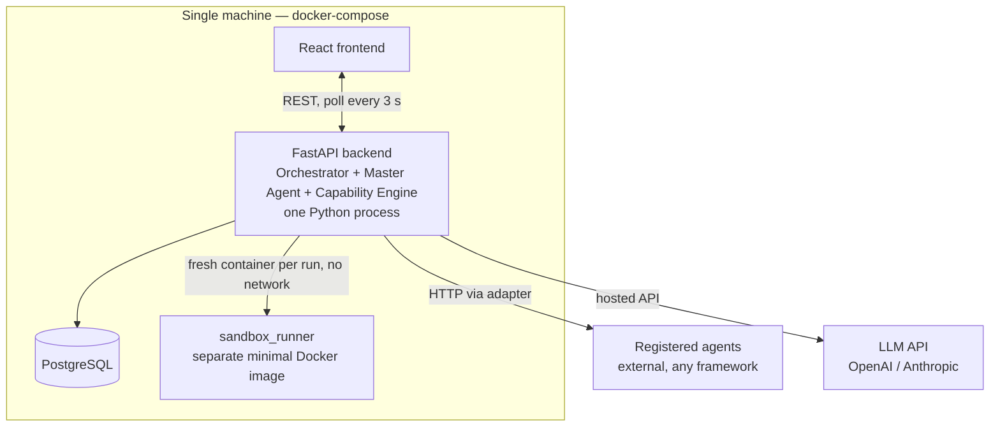
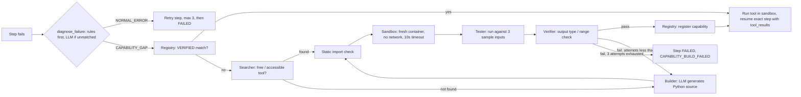
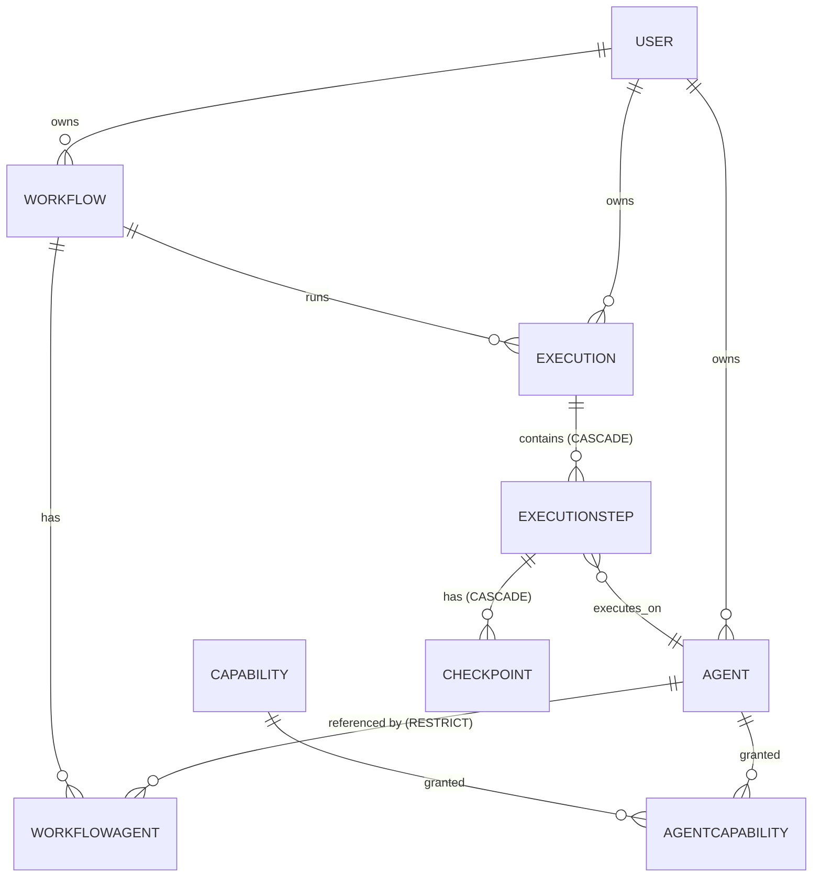
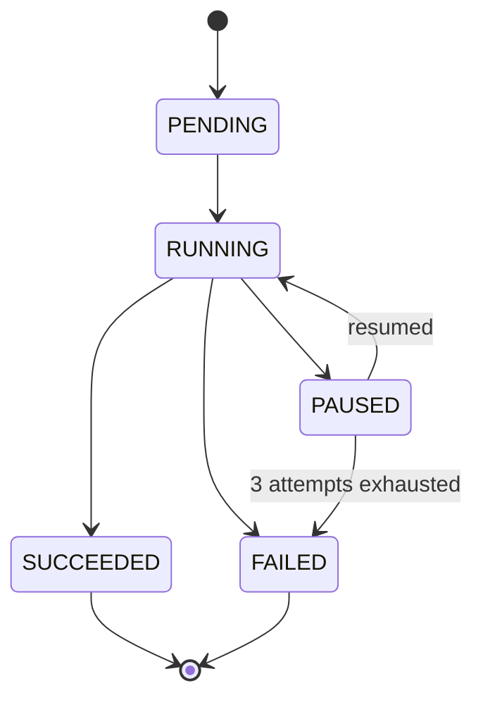
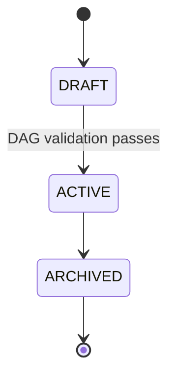
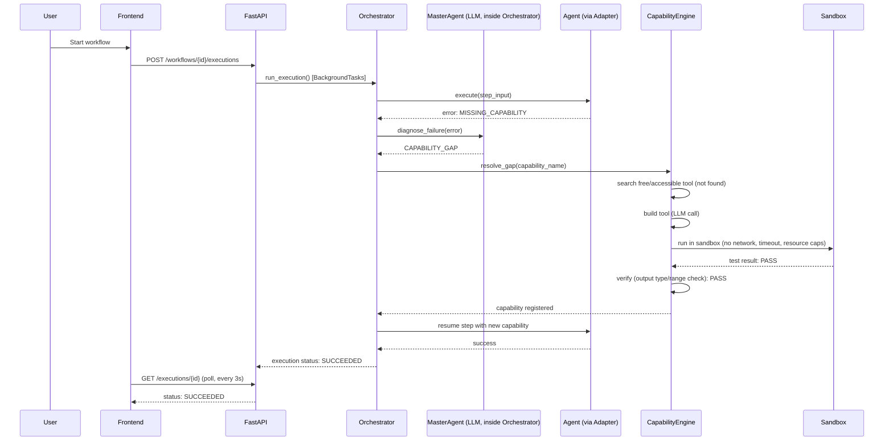

# AGEM — Architecture Document

| | |
|---|---|
| **Product** | AGEM — Agent Workflow & Capability Evolution Platform |
| **Version** | 1.0 (aligned with the AGEM Master Documentation — Final) |
| **Team** | Ananya (Orchestration, Integration & Frontend) · Guthal (Intelligence, Capability Engine & Safety) |
| **Status** | Final (mirrors the AGEM Master Documentation) |
| **Companion docs** | AGEM FRS (requirements + test cases) · AGEM Master Documentation (BRD · PRD · TRD · HLD · LLD · ADRs · Roadmap) |

---

## Table of Contents
1. Introduction
2. Goals, Non-Goals, Constraints, Assumptions
3. Architectural Principles and Rules
4. Quality Attributes
5. System Context
6. Deployment
7. Layered Architecture
8. Container View
9. Layer 1 — Presentation
10. Layer 2 — API
11. Layer 3 — Orchestration
12. AI Safety / Guardrails
13. Layer 4 — Capability Engine & Safety
14. Layer 5 — Data
15. State Machines
16. API Architecture
17. Key Flows
18. Security Architecture
19. Scalability and Performance
20. Reliability and Recovery
21. Observability
22. Cost Architecture
23. Error Handling Model
24. Configuration
25. Code Organization
26. Testing Architecture
27. Versioning and Migration
28. User Flow
29. Roadmap: Components × Weeks
30. Technology Stack
31. Architecture Decision Records
32. Risks
33. Decisions

---

## 1. Introduction

### 1.1 Purpose
This document describes **how AGEM is built**: its layers, components, data, interfaces, deployment, security and operations. It is the technical reference for the team and for the viva defence. The FRS says *what* AGEM does; this document says *how*.

### 1.2 Scope
The five-layer system (Presentation, API, Orchestration, Capability and Safety, Data), the sandbox trust boundary, the Master Agent / Orchestrator split, the Capability Engine pipeline, the single-node deployment, and the end-to-end user and demo flow.

### 1.3 Audience
The two-person team building AGEM, and anyone reviewing or examining it.

### 1.4 Glossary

| Term | Meaning |
|---|---|
| Agent | A self-contained worker that does one job (research, calculate, write). Brought into AGEM, not built by AGEM. |
| LLM | A language model (e.g. GPT-4, Claude) called via API to diagnose failures and generate new tools. |
| Orchestrator | The engine that runs a workflow: decides which agent goes next, passes data between agents, handles state. |
| Capability | A specific skill or tool an agent needs but might not have (e.g. "calculate compound interest"). |
| Tool | The actual implementation of a capability (a Python function, an API call). |
| Capability Engine | The system that detects a capability gap and resolves it: search → build → sandbox → test → verify → register. |
| Adapter | A wrapper that translates a specific agent's interface (LangChain/CrewAI/REST) into AGEM's standard contract, so the Orchestrator doesn't need to know what framework the agent uses. |
| Registry | A database table of verified capabilities so they can be reused instead of rebuilt. |
| Sandbox | An isolated Docker container where untrusted generated code runs safely without access to the main system. |
| Verifier | The check that a generated tool's output is actually correct for the real task, not just that it ran without crashing. |
| Checkpoint | The stored record of current step, prior successful outputs, pending inputs, workflow state and recovery information, used to resume exactly where a workflow paused. |
| Execution / ExecutionStep | One run of a workflow, and one run of one step inside it. |
| Workflow / WorkflowAgent | A saved DAG definition, and the row declaring one agent's step order, dependency and input mapping inside it. |

---

## 2. Goals, Non-Goals, Constraints, Assumptions

### 2.1 Goals (Product Principles)
- G1. Bring existing agents rather than rebuilding them.
- G2. Separate supervision/diagnosis (Master Agent) from execution (Orchestrator) conceptually, even though for MVP they run in the same service.
- G3. Never restart a whole workflow — resume only the failed step.
- G4. Check for a free/accessible tool before generating a new capability.
- G5. Never trust a newly generated/acquired capability without sandboxing, testing, and verification.
- G6. Reuse verified capabilities via a capability registry instead of rebuilding them.
- G7. Start with the simplest version that runs, then layer in recovery and capability evolution — build first, document what was actually built.

### 2.2 Non-goals (MVP)
AGEM is not just an agent builder, a chatbot, an n8n replacement, a workflow editor, an LLM wrapper, or "another" multi-agent framework — it is an agent interoperability, orchestration, supervision and capability-evolution platform.

**Deferred to later ("Do later"):** marketplace, billing, advanced autonomous planning, large-scale Kubernetes deployment, sophisticated memory systems, enterprise RBAC, very large agent swarms.

**Also deferred, per the finalized tech stack:** LangGraph; LangChain as a required dependency (only used as one optional adapter); vector databases; RAG; embeddings; Celery/Redis (only added if the async job queue becomes a real pain point, not before Week 8).

### 2.3 Constraints
- A 2-person team delivering a demonstrable MVP within a 12-week academic timeline, without dedicated infrastructure beyond Docker, PostgreSQL and a hosted LLM API.
- The UI holds no business logic and no execution state — everything it displays comes from polling the API.
- AGEM never runs any imported or self-built code directly on its main server; every piece of code runs inside an isolated environment first.
- All product code decisions are finalized: React + TypeScript frontend, Python + FastAPI backend.
- Every enum is defined once in `backend/app/models/` and mirrored in `frontend/src/types/`, so no status string is ever hardcoded in a component or an API handler.

### 2.4 Assumptions
- Skill level is assumed intermediate — comfortable with Python and basic web development; learning FastAPI, LLM API integration and Docker during the build. No prior production experience with orchestration systems or container security is assumed.
- The developer supplies their own LLM API key or local models.
- The machine has network access for cloud providers and for reaching registered REST agent endpoints.
- Git is installed (for the repository itself; AGEM's own workspace features do not depend on it).

---

## 3. Architectural Principles and Rules

| # | Principle / rule | Consequence |
|---|---|---|
| P1 | One backend service, not microservices | Orchestrator, Master Agent logic, adapters and the Capability Engine all run in one FastAPI process; only the sandbox is a separate image |
| P2 | The API layer never blocks | `POST /workflows/{id}/executions` returns an `execution_id` immediately; the run proceeds via `BackgroundTasks` |
| P3 | The database is the only source of truth | Every step transition and checkpoint is written before the next step starts |
| P4 | Exactly one trust boundary | The main backend process and the sandbox container; generated code never crosses it inward |
| P5 | Agents are external and opaque | AGEM calls them over HTTP through an adapter — this is what makes "bring your own agent" possible without a rebuild |
| P6 | Framework knowledge lives only in adapters | Supporting a new framework means adding one file in `adapters/`; nothing in `orchestrator/` changes |
| P7 | Failure is a first-class path | Every step has two defined outcomes — success (advance) or failure (pause, checkpoint, diagnose) — both modelled explicitly |
| P8 | LLM judgement is confined to one function | `master_agent.py` is the single place an LLM influences control flow; every other orchestration decision is deterministic code |
| P9 | Recovery is internal, never user-triggered | There is no public resume endpoint; resume only ever follows a successful diagnosis or a verified capability |
| P10 | The DAG is validated at creation, not at execution | An invalid workflow can never reach the Orchestrator |
| P11 | Everything is bounded | One diagnosis call per failure, three build attempts per gap, a sandbox timeout, CPU/memory caps — no loop in the system is unbounded |
| P12 | Single-node by design | `docker-compose` brings up frontend, backend, PostgreSQL and the sandbox image on one machine; horizontal scale is Future Scope |
| P13 | All errors are normalised at one point | Every exception and structured agent error becomes one shape inside `step_executor.py` before anything else sees it |
| P14 | One responsibility per file | `orchestrator.py` decides order, `step_executor.py` performs one step, `checkpoint_manager.py` persists state, `master_agent.py` classifies failures |
| P15 | Every LLM call goes through one wrapper | It requests JSON, validates against a Pydantic schema, retries twice, then fails safe to `NORMAL_ERROR` |
| P16 | Secrets have one entry point | LLM keys and agent credentials are read through `core/config.py` only; agent credentials are Fernet-encrypted at rest |

---

## 4. Quality Attributes

| Attribute | Target | How the architecture achieves it |
|---|---|---|
| Performance | 1–5 concurrent executions; <300 ms orchestrator overhead per step; 3 s dashboard refresh; diagnosis <8 s typical (20 s timeout); capability build→sandbox→test→verify loop <60 s | Async FastAPI `BackgroundTasks`, `asyncio.gather` for sibling steps, deterministic bookkeeping separated from agent/LLM call time |
| Security | Never run untrusted code on the main server | Per-run Docker container, no internet, resource caps, secret isolation, controlled network access, audit logs |
| Reliability | Retry/recovery logic and step checkpoints so execution resumes without restarting | Step-level pause, checkpoint written twice per step, bounded retries |
| Auditability | Execution history, errors, recovery events, capability acquisition/build history, and verification results recorded as outputs | Structured logging correlated by `execution_id`/`step_id`/`agent_id`; `FAILED` capability rows kept, never deleted |
| Accessibility | A deliberate baseline, not a full WCAG audit | Semantic HTML over generic divs, visible keyboard focus states, labelled form inputs, status badges pairing colour with a text label or icon |
| Cost | LLM API usage bounded by hard call budgets | At most 1 diagnosis call per failure, at most 3 build/repair attempts per gap; cheaper model tier for diagnosis, stronger model for code generation; no GPU or local model hosting |

---

## 5. System Context



**Trust boundary:** there is exactly one trust boundary in the whole system — the main backend process and the sandbox container. Generated code never crosses it inward. Everything else in the system is code the team wrote.

---

## 6. Deployment

AGEM runs in exactly one deployment mode: a single machine, single-node, self-hosted, brought up with one `docker-compose.yml`. There is no hosted or multi-tenant mode in this project's scope.

| Environment | Purpose | Data |
|---|---|---|
| Local development | Each team member's own machine, `.env` pointing at their own LLM API key | Personal/dev data |
| Demo | One machine, seeded with `scripts/seed_agents.py` before the viva | Seeded demo agents and workflows |

There is deliberately no staging or production stage — there is no hosted deployment target in this project's scope, so a promotion process would have nothing to promote to. Runtime technology is Docker, coordinated locally via `docker-compose.yml`.

---

## 7. Layered Architecture

AGEM is a five-layer system. Each layer may only call the layer directly below it; nothing skips a layer.

```
┌─────────────────────────────────────────────────────────────────┐
│ 1. PRESENTATION   React SPA. Holds no business logic and no      │
│                   execution state — everything it displays       │
│                   comes from polling the API.                    │
└───────────────────────────────┬───────────────────────────────────┘
                                 │ REST, poll every 3 s
┌───────────────────────────────▼───────────────────────────────────┐
│ 2. API            FastAPI routers (agents, workflows, executions,│
│                   capabilities). Stateless, validates every body │
│                   with Pydantic, starts work and returns         │
│                   immediately. Never blocks on a running         │
│                   execution.                                     │
└───────────────────────────────┬───────────────────────────────────┘
┌───────────────────────────────▼───────────────────────────────────┐
│ 3. ORCHESTRATION  orchestrator.py, step_executor.py,              │
│                   checkpoint_manager.py, master_agent.py. The     │
│                   only layer that decides what runs next, and    │
│                   the only layer that writes execution state.    │
└──────────────────┬────────────────────────────┬────────────────────┘
┌──────────────────▼───────────────┐ ┌───────────▼────────────────────┐
│ 4. CAPABILITY AND SAFETY          │ │ 5. DATA                        │
│ capability_engine/ plus the       │ │ PostgreSQL — the single source │
│ separate sandbox_runner image.    │ │ of truth for agents, workflows,│
│ The only layer that generates or  │ │ executions, checkpoints and    │
│ executes untrusted code, and the  │ │ the capability registry. No    │
│ only one that crosses a container │ │ execution state lives only in  │
│ boundary.                         │ │ memory.                        │
└────────────────────────────────────┘ └──────────────────────────────────┘
```

**Outside all five layers:** the user's own agents, reached solely through adapters over HTTP. AGEM never imports agent code into its own process.

---

## 8. Container View



Orchestrator, Master Agent logic, adapters and the Capability Engine all run in one FastAPI process; only the sandbox is a separate image. Separation is by module boundary, not network boundary — a 2-person team cannot afford to debug service-to-service failures on top of agent failures.

---

## 9. Layer 1 — Presentation

### 9.1 Frontend
- **Tech:** React + TypeScript, Tailwind CSS, React Flow (for the workflow/DAG visualization).
- **Navigation:** a persistent left sidebar with exactly five items — Dashboard, Agents, Workflows, Executions, Capabilities. No deeper navigation hierarchy is needed for an MVP of this size.
- **Components:** `WorkflowGraph.tsx` (React Flow canvas, read-only), `StepStatusCard.tsx`, `CapabilityPanel.tsx`, `AgentCard.tsx`; `api/` for axios calls; `types/` for TypeScript interfaces mirroring the backend enums.

### 9.2 Key decision — form-based workflow creation, not drag-and-drop
React Flow is used to *visualize* a workflow's DAG (read-only, on the Workflows and Executions pages), not to author it. Workflow creation itself is a simple ordered form — pick agents from a dropdown, declare each step's upstream dependency from a select list — not a free-form drag-and-drop graph editor.

A real drag-and-drop graph editor (node placement, edge drawing, cycle prevention in the UI, layout persistence) is a multi-week frontend project on its own. For a 2-person, 12-week build where Person 1 owns the entire frontend alongside orchestration and adapters, that scope would crowd out the Execution monitor page and the Capabilities view. A form-based creator with a read-only visual confirmation gets 90% of the perceived value for a fraction of the build cost.

### 9.3 Page states
Loading skeleton, empty state with a call-to-action, error toast on failed registration, inline validation error on a cyclic workflow, and a distinct "capability gap in progress" node state (build/sandbox/test/verify) on the Executions page.

### 9.4 Accessibility baseline
Semantic HTML elements over generic divs, visible keyboard focus states, labelled form inputs, and status badges that pair colour with a text label or icon rather than relying on colour alone — so a step's status stays readable on an unfamiliar screen or a colour-limited projector.

---

## 10. Layer 2 — API

### 10.1 Conventions
- Concrete endpoint list matches the confirmed `backend/app/api/` module split (`agents.py`, `workflows.py`, `executions.py`, `capabilities.py`), documented verbatim in `docs/api-spec.md`.
- All request/response bodies are validated via Pydantic schemas in `backend/app/schemas/`, with `extra = "forbid"` so unknown fields are rejected rather than silently ignored.
- Every 4xx/5xx response uses one error envelope: `{"error_code": "AGENT_NOT_FOUND", "message": "...", "details": {...}}`.
- Auth: a single `API_KEY` value in `.env`, checked via one `get_api_key` FastAPI dependency applied globally, sent as the `X-API-Key` header.

### 10.2 Error code catalogue

| Error Code | HTTP Status | When |
|---|---|---|
| `VALIDATION_ERROR` | 422 | Pydantic schema validation failure on any request body |
| `AGENT_NOT_FOUND` / `WORKFLOW_NOT_FOUND` / `EXECUTION_NOT_FOUND` / `CAPABILITY_NOT_FOUND` | 404 | Lookup by ID fails |
| `WORKFLOW_CYCLE_DETECTED` | 400 | Workflow creation rejected because the declared dependencies are not a valid DAG |
| `UNAUTHORIZED` | 401 | Missing or invalid `X-API-Key` header |
| `CAPABILITY_BUILD_FAILED` | 500 | The Capability Engine exhausted its repair-attempt limit without producing a verified capability |

### 10.3 Endpoint groups

| Method & Path | Purpose | Notes |
|---|---|---|
| `POST /api/agents` | Register an agent | Returns the created Agent with status `ACTIVE` |
| `GET /api/agents` | List agents | Backs the Agents page table |
| `GET /api/agents/{agent_id}` | Agent detail | `404 AGENT_NOT_FOUND` if missing |
| `DELETE /api/agents/{agent_id}` | Remove an agent | `409` if referenced by an active workflow |
| `POST /api/workflows` | Create a workflow definition | Validated as a DAG at creation time |
| `GET /api/workflows` | List workflows | Backs the Workflows page |
| `GET /api/workflows/{workflow_id}` | Workflow detail | Includes the DAG structure consumed directly by React Flow |
| `POST /api/workflows/{workflow_id}/executions` | Start an execution | Returns `execution_id` immediately; proceeds via `BackgroundTasks` |
| `GET /api/executions/{execution_id}` | Execution status + steps | Polled every 3 s; includes each step's status and, on a capability gap, the current sub-stage |
| `GET /api/executions/{execution_id}/steps/{step_id}` | Step detail | Includes error, diagnosis result, and checkpoint reference |
| `GET /api/capabilities` | List the capability registry | Read-only |
| `GET /api/capabilities/{capability_id}` | Capability detail | Includes `verification_score` and source (built vs. acquired) |

**Deliberately not exposed:** a public "resume step" endpoint. Resume is always an internal consequence of a successful diagnosis or a successful capability build inside the Orchestrator — never a user-triggered action in the MVP.

---

## 11. Layer 3 — Orchestration

### 11.1 Subsystems

| Subsystem | File | Responsibility |
|---|---|---|
| Orchestrator | `orchestrator/orchestrator.py` | Executes steps, DAG, state; the primary running service |
| Step Executor | `orchestrator/step_executor.py` | Calls agent adapters; normalises every error into one shape |
| Checkpoint Manager | `orchestrator/checkpoint_manager.py` | Save/load step state |
| Master Agent | `orchestrator/master_agent.py` | Failure diagnosis — rules first, one LLM call only for unmatched errors (ADR-008); called by the Orchestrator on failure |

The Orchestrator does not plan: the user defines the workflow, and the Orchestrator only executes that already-validated DAG. A plain-language walkthrough of this layer, with pseudocode, is in `docs/final_flow.md` §3.

### 11.2 Scheduler algorithm

```
run_execution(execution_id):
    load the workflow snapshot (step_order fixed at creation time; never re-sorted)
    repeat until every step is SUCCEEDED or one is FAILED:
        READY steps = PENDING steps whose depends_on are all SUCCEEDED
        READY siblings run together under asyncio.gather
          (build the plain sequential version first, then add gather)

        run_step(step):
            call the agent via its adapter: execute(input) -> output
            on success:
                write checkpoint (success)
                pass output to the declared downstream step(s)
                advance
            on failure:
                write checkpoint (paused); mark step PAUSED
                diagnose_failure(step_id, error) -> NORMAL_ERROR | CAPABILITY_GAP
                    rules on error_type first; LLM only if no rule matches (ADR-008)
                NORMAL_ERROR  -> retry the step (max 3); still failing -> mark step FAILED
                CAPABILITY_GAP -> CapabilityEngine.resolve_gap(capability_name, context)
                    reused/found/built + verified -> run tool in sandbox,
                        resume exact step with context.tool_results
                    exhausted (3 attempts) -> mark step FAILED

    Execution.status rolls up from its steps:
        PAUSED if any step is PAUSED
        FAILED if any step is FAILED
        SUCCEEDED only when every step is SUCCEEDED
```

### 11.3 Checkpoint contents
Current step, prior successful outputs, pending inputs, workflow state and recovery information — stored as JSONB and read by the next step's input instead of recomputing an upstream step. The checkpoint is written when a step succeeds and again at the moment a step pauses, never only at the end of a workflow.

### 11.4 LLM usage inside Orchestration
`master_agent.py` is the single place where an LLM influences control flow. Diagnosis is two-stage (ADR-008): explicit error types are classified first by deterministic rules — `MISSING_CAPABILITY` → `CAPABILITY_GAP`; `TIMEOUT`, `CONNECTION_ERROR`, `HTTP_5XX`, `INVALID_JSON` → `NORMAL_ERROR` — and only unmatched errors reach the LLM, so a failure costs at most one LLM call and often none. The LLM call requests a JSON response constrained to a fixed Pydantic schema; on parse/validation failure it retries the same call up to 2 times with the validation error appended to the prompt; after that, it fails safe to `NORMAL_ERROR` rather than proceeding on an unvalidated response. Diagnosis uses a cheaper model tier than capability generation, since it is a short structured-output classification prompt.

### 11.5 Step state — design pattern note
`ExecutionStep.status` is a plain enum plus one `can_transition(old, new)` function. This is an explicit rejection of a formal State-design-pattern class hierarchy — with five states, that would be over-engineering that costs more time than it saves for this team.

---

## 12. AI Safety / Guardrails

These are concrete controls, not aspirations — each maps to a specific setting or check owned by Person 2 during Weeks 3–10.

| Control | Implementation | Enforced where |
|---|---|---|
| Sandbox isolation | `--network none` (no network access at all), a hard execution timeout (10 s per test run), resource caps (`--memory=256m --cpus=0.5`) | `sandbox_runner/` (literal Docker run flags) |
| Import allowlist | No `os.system`, `subprocess`, `socket`, or `open()` outside a scratch temp directory | First layer: a cheap static check of the generated code's imports before it ever reaches the sandbox. Second layer: the sandbox's own network/filesystem restrictions |
| Schema-constrained LLM output | Every LLM call requests a JSON response constrained to a fixed Pydantic schema | `master_agent.py`, `builder.py` |
| Validation retry + fail-safe | Retry the same call up to 2 times with the validation error appended to the prompt; after that, fail safe to `NORMAL_ERROR` rather than proceed on an unvalidated response | LLM wrapper (single entry point, no module calls the LLM API directly) |
| Bounded build/repair attempts | A hard cap of 3 build/repair attempts per capability gap | `capability_engine/` — after 3 failures the step is marked `FAILED` and surfaced to the user instead of looping indefinitely |
| Full audit logging | Every LLM call and every sandbox execution is logged (prompt, response, verdict) | Structured JSON logs — this is the only way to explain after the fact why a given generated tool was trusted |

---

## 13. Layer 4 — Capability Engine & Safety

### 13.1 Pipeline



### 13.2 Key interfaces (function signatures)
These signatures are the contract between the two people's work — fixing them lets both build in parallel from Week 3 without waiting on each other.

| Signature | File |
|---|---|
| `CapabilityEngine.resolve_gap(capability_name: str, context: dict) -> Capability \| None` | `capability_engine/engine.py` |
| `Searcher.find_free_tool(capability_name: str) -> Tool \| None` | `capability_engine/searcher.py` |
| `Builder.build(capability_name: str, spec: dict) -> str` — returns Python source, never executes it | `capability_engine/builder.py` |
| `Sandbox.run(code: str, inputs: list[dict]) -> SandboxResult` | `capability_engine/sandbox.py` |
| `Tester.test(code: str, samples: list[dict]) -> TestResult` — 3 sample inputs for MVP | `capability_engine/tester.py` |
| `Verifier.verify(result: TestResult, expected_type: type, expected_range: tuple \| None) -> float` — returns the `verification_score` | `capability_engine/verifier.py` |
| `Registry.register(name: str, version: str, code: str, score: float) -> Capability` | `capability_engine/registry.py` |

### 13.3 Design patterns
- **Chain of Responsibility:** the diagnosis/recovery pipeline (normal-error check → free-tool search → build → sandbox → test → verify) is implemented as a simple ordered list of functions called in sequence — explicitly *not* a formal class-per-handler OOP hierarchy, since that ceremony buys nothing at this scale.
- **Registry:** maps capability name+version → verified implementation, backed by the Capability table. Confirmed, core.

### 13.4 Sandbox invocation (fixed)
A fresh container per run, code and inputs passed in by file mount, `--network none`, a 10-second timeout, `--memory=256m --cpus=0.5`, and the container destroyed afterwards so no state carries between capability tests.

### 13.5 What must be real vs. what can be simplified

| Stage | MVP Treatment |
|---|---|
| Agent reports missing capability | REAL — structured error object, e.g. `{"error": "MISSING_CAPABILITY", "capability": "..."}` |
| Detect missing capability | REAL — `master_agent.py` calls the LLM and classifies the failure |
| Build/acquire capability | REAL for "build" (LLM generates a Python function). SIMPLIFIED for "acquire" (a hardcoded web-search check, not a general discovery system) |
| Sandbox | REAL — a separate Docker container, no internet access, execution timeout. Not simplified: this is a core safety claim |
| Test / Verify | REAL for test (3 sample inputs). SIMPLIFIED for verify (output type/range check, not full formal verification) |
| Register | REAL — written to the capability table in PostgreSQL |
| Agent resumes | REAL — the Orchestrator resumes the paused step and passes the new capability to the agent |
| Another agent reuses the capability | REAL but simple — a second agent hitting the same gap finds it in the registry instead of rebuilding it |

---

## 14. Layer 5 — Data

### 14.1 Core entities

| Entity | Fields |
|---|---|
| User | `user_id, email, api_key_hash, created_at` — MVP has no login, so a single seeded user row owns everything |
| Agent | `agent_id, user_id, name, framework, endpoint/runtime, description, status` |
| Capability | `capability_id, name, version, source, status, verification_score, implementation reference` |
| AgentCapability | `agent_capability_id, agent_id, capability_id, granted_at, granted_by` — join table |
| Workflow | `workflow_id, user_id, name, definition, status` |
| WorkflowAgent | `workflow_agent_id, workflow_id, agent_id, step_order, depends_on, input_mapping` |
| Execution | `execution_id, workflow_id, user_id, status, started_at, finished_at, final_output, error_summary` |
| ExecutionStep | `step_id, execution_id, agent_id, input, output, status, error, checkpoint/state reference, timestamps` |
| Checkpoint | current step, prior successful outputs, pending inputs, workflow state, recovery information |

### 14.2 Conventions
- Primary keys are application-generated UUIDs, not auto-increment integers — an ID can be returned by a POST before the row is committed, and is safe to expose in a URL.
- Every table carries `created_at` and `updated_at`, stored in UTC.
- Status columns are Python Enums, never free strings.
- Free-form structures (workflow definition, step input/output, checkpoint state) are JSONB columns rather than separate tables.
- Foreign keys: `ON DELETE RESTRICT` from Agent to WorkflowAgent (produces the 409 on `DELETE /api/agents/{id}`); `ON DELETE CASCADE` down Execution → ExecutionStep → Checkpoint.
- After the first migration exists, schema changes go through Alembic only — no manual edits to `database/init.sql`.

### 14.3 Entity relationships



### 14.4 Thin repository
Each SQLAlchemy model gets a small set of plain CRUD functions in `backend/app/db/`, not a generic repository abstraction layer — a full generic repository pattern is unnecessary indirection for four or five entities.

---

## 15. State Machines

### 15.1 ExecutionStep.status



`SUCCEEDED` and `FAILED` are final — once a step reaches one of these it can't change. A single `can_transition(old, new)` function enforces this.

### 15.2 ExecutionStep.recovery_stage
`NONE → DIAGNOSING → SEARCHING → BUILDING → SANDBOXING → TESTING → VERIFYING → REGISTERED`. Only meaningful while status is `PAUSED`. This is what the Executions page renders as the "capability gap in progress" node state; keeping it separate is what lets the status enum stay at five values.

### 15.3 Execution.status (rollup)
`PENDING, RUNNING, PAUSED, SUCCEEDED, FAILED` — rolled up from its steps: `PAUSED` if any step is `PAUSED`, `FAILED` if any step is `FAILED`, `SUCCEEDED` only when every step is `SUCCEEDED`.

### 15.4 Agent.status
`ACTIVE, INACTIVE`. Registration creates `ACTIVE`. An `INACTIVE` agent cannot be added to a new workflow, but executions that already reference it still resolve — which is why `DELETE /api/agents/{id}` returns 409 rather than cascading.

### 15.5 Workflow.status



A workflow can only become `ACTIVE` after its DAG passes validation at creation time — this guarantees a broken or invalid workflow can never reach the Orchestrator for execution.

### 15.6 Capability.status
`BUILDING, VERIFIED, FAILED`. Only `VERIFIED` rows are ever handed to an agent or reused from the registry; `FAILED` rows are kept for the audit trail rather than deleted, because "why was this tool rejected" is a viva question.

---

## 16. API Architecture

See §10 for the full endpoint table and error catalogue. Summary of conventions:
- One error envelope for every 4xx/5xx response.
- Pydantic validation with `extra = "forbid"` on every request body.
- Stateless routers — the API layer never blocks on a running execution; it validates, starts work via `BackgroundTasks`, and returns immediately.
- Auth: a single `X-API-Key` header checked by one global FastAPI dependency.

### 16.1 Agent contract (AGEM → agent)

Agents are external and reached only over HTTP (P5, ADR-005). Every registered agent answers exactly two calls; the contract is frozen in `docs/api-spec.md`:

```
GET  {endpoint}/health    → 200 OK      (called once at registration; failure rejects the agent)

POST {endpoint}/execute
  request:  { "task": "...", "input": {...}, "context": {...} }
  success:  { "status": "SUCCEEDED", "output": {...} }
  failure:  { "status": "FAILED", "error": "MISSING_CAPABILITY", "capability": "..." }
```

`context.tool_results` carries the result of a verified capability when a paused step resumes (ADR-008). Agents that exist only as code are exposed through a wrapper template in `agent_wrappers/` — a small FastAPI file that imports the developer's agent in *their* process, never in AGEM's. `framework` is one of `rest`, `langchain` or `crewai` (whichever framework adapter is built), and `mcp` only if FR-ADP-009 is built; a plain Python agent registers as `rest` behind `python_wrapper.py`.

---

## 17. Key Flows

### 17.1 Failure → diagnosis → capability gap → resume
This is AGEM's core differentiator and the centerpiece of the demo.



### 17.2 End-to-end control flow
1. The user submits a big task or goal.
2. They choose the work type: single agent or multiple agents.
3. They bring/import their existing agent(s).
4. The agent(s) are deployed.
5. The agents are connected into a workflow.
6. The Orchestrator's Master Agent logic starts overseeing the workflow.
7. The Orchestrator begins executing the workflow, coordinating order and state.
8. Agent(s) run their assigned step.
9. If the step succeeds → move to the next step → repeat until done → final result.
10. If the step fails → pause only that step and preserve a checkpoint.
11. The Master Agent logic diagnoses what went wrong.
12. If it's a normal error → retry the step (max 3), then continue; if it still fails, mark it FAILED.
13. If it's a capability gap → check for a free/accessible tool first; if not found, invoke the Capability Engine: build/acquire → sandbox → test → verify → loop on failure, register on success.
14. Resume exactly the interrupted step (not the whole workflow).
15. Continue the rest of the task.
16. Return the final result.

---

## 18. Security Architecture

### 18.1 Main rule
Never execute arbitrary imported/generated code directly on the main AGEM server.

### 18.2 Controls

| Control | Detail |
|---|---|
| Isolated containers/sandbox | `sandbox_runner/`, a separate minimal Docker image |
| Resource limits | CPU/memory limits, execution timeouts |
| Filesystem | Restricted filesystem access |
| Secrets | Secret isolation — LLM provider keys live only in the backend's `.env`/Docker secrets, never in PostgreSQL, never echoed in any API response |
| Network | Controlled network access — no internet access from inside the sandbox |
| Audit | Audit logs for every LLM call and sandbox execution |

### 18.3 MVP security approach
Prefer API/container execution and keep arbitrary code execution strongly isolated. Concretely: a per-run Docker container, or as a lighter fallback a Python subprocess with a timeout and restricted imports — never running generated code directly in the FastAPI backend process. A dedicated security review pass is scheduled for Week 11, owned by Person 2.

### 18.4 Authentication / Authorization
Static API key authentication for the entire MVP. A single shared secret (or one key per team member) is sent as an `X-API-Key` header on every request and checked by one FastAPI dependency applied to all routers. No OAuth, no user accounts/login, no RBAC — the actual users of the MVP are the 2 team members plus an examiner watching a single live demo session.

### 18.5 Data protection
- If a registered agent's own REST endpoint requires credentials, they are stored encrypted at rest using a single symmetric key (Fernet), added as an `encrypted_credentials` column on the Agent model.
- No end-user PII is collected anywhere in AGEM's MVP scope.
- Audit logs record execution/step/capability metadata (IDs, timestamps, status, diagnosis outcome) by default — not full raw agent input/output payloads. Full payload logging can exist as an explicit debug-only flag, never the default.

---

## 19. Scalability and Performance

| Area | Approach |
|---|---|
| Concurrency model | Run everything on one single computer/server via `docker-compose`, not spread across many machines |
| Multiple tasks at once | FastAPI's built-in `async`/`await` and `BackgroundTasks` run workflow executions in the background — no Celery, no Redis, no separate worker processes |
| Why | Celery + Redis needs a message broker, separate worker processes, and task serialization — complexity that only becomes worth it at 10+ simultaneous workflows. For a 2-person team demoing 1–5 workflows, that's more moving parts to break right before the Week 11 security review. Confirmed in ADR-007 |
| Backup plan | If, by Week 8, CPU-heavy work (e.g. building many capabilities at once) is freezing the event loop, `step_executor.py` and the Capability Engine move into a `ThreadPoolExecutor`/`ProcessPoolExecutor` — extra workers within the same app, not a new external system |
| Kubernetes | Not needed for this project's 12-week plan or demo; stays a "maybe someday" idea, not something being built now |

---

## 20. Reliability and Recovery

### 20.1 Reliability
- If one step in a workflow fails, only that step pauses — not the whole thing.
- A checkpoint remembers exactly where things stopped, so execution can pick back up from that exact spot.
- Built-in retry logic tries again before giving up.
- The entire workflow is never restarted from zero — only the one broken step gets re-run, saving time, cost, and already-completed agent work.

### 20.2 Rollback
No automated rollback pipeline. Rollback means `git revert` to the last known-good commit, then `docker-compose up --build`. Database schema rollback uses Alembic's `downgrade` command against the migration that introduced the breaking change.

This is sufficient because there is exactly one deployment target — the local docker-compose environment used for development and the demo — not a live service with real users who would be affected by a bad deploy.

---

## 21. Observability

### 21.1 Decision
Structured JSON logging via Python's standard `logging` module, with every log line carrying `execution_id`, `step_id`, and `agent_id` where applicable, written to stdout and captured by Docker — no dedicated logging service (no ELK, no Datadog).

The Executions dashboard page is the intended primary observability tool for this project, not an external metrics stack. Metrics beyond what is itemized below are not needed for MVP; full distributed tracing (OpenTelemetry) is explicitly deferred to a future, larger-scale iteration.

### 21.2 Outputs
Final task result; execution history; agent outputs; errors and recovery events; capability acquisition/build history; verification results; logs and metrics.

---

## 22. Cost Architecture

The only real variable cost in AGEM's MVP is LLM API calls, made from exactly two places: `master_agent.py` (failure diagnosis) and `builder.py` (capability generation).

| Decision | Detail |
|---|---|
| Cheaper model tier for diagnosis | Classifying a failure as `NORMAL_ERROR` vs. `CAPABILITY_GAP` is a short prompt with a small structured JSON output — it does not need a top-tier model. A stronger model is reserved specifically for capability code generation in `builder.py`, where correctness matters far more. The single highest-leverage cost decision available |
| Hard call budget per execution | At most 1 diagnosis call per failure; at most 3 build/repair attempts per capability gap. Bounds worst-case LLM cost per demo run to a small, predictable number of calls |
| No local model hosting | A hosted LLM API (OpenAI or Anthropic) is used rather than running a model locally — avoids GPU infrastructure cost and setup time entirely |
| No infrastructure cost beyond the LLM bill | PostgreSQL, Docker, and the sandbox all run locally via docker-compose for the build and the demo |

---

## 23. Error Handling Model

### 23.1 Runtime error normalization
Every step execution is wrapped in try/except inside `step_executor.py`. Any exception or structured agent error is normalized into one internal shape — `{"status": "FAILED", "error_type": "...", "raw_error": "..."}` — before being handed to `master_agent.py`. `error_type` is always one of `MISSING_CAPABILITY`, `TIMEOUT`, `CONNECTION_ERROR`, `HTTP_5XX`, `INVALID_JSON`, or the fallback `AGENT_ERROR`; the diagnosis rules (ADR-008) match on these exact strings. When the agent names the missing tool, an extra `capability` field carries that name to the Capability Engine. This single-shape normalization is what makes diagnosis reliable.

### 23.2 Failure & recovery summary

| Situation | What happens |
|---|---|
| Step succeeds | Orchestrator moves to the next step normally |
| Step fails — normal error | Only that step pauses; retried up to 3 times, then marked `FAILED` — no rebuilding needed |
| Step fails — capability gap, already in registry | The `VERIFIED` capability is reused; the paused step resumes |
| Step fails — capability gap, free tool exists | Tool goes through static check → sandbox → test → verify, then the paused step resumes |
| Step fails — capability gap, no free tool | Capability Engine builds → static check → sandbox → test → verify |
| Verification fails | Improve/rebuild the capability and test again, bounded by the retry limit |
| Verification passes | Capability is registered, run in the sandbox, and its result is passed to the exact step as it resumes |

The whole workflow is never restarted from scratch — only the failed step is ever re-run.

---

## 24. Configuration

LLM provider API keys and agent credentials are read through `core/config.py` only — the single entry point for secrets. Agent credentials that a registered endpoint requires are Fernet-encrypted at rest rather than stored as plaintext. Beyond the single `.env` file holding `API_KEY`, the LLM provider key, and the Fernet encryption key, no further configuration layering is defined for the MVP.

---

## 25. Code Organization

```
agem/
├── README.md
├── .env.example
├── .gitignore
├── docker-compose.yml
│
├── frontend/
│   └── src/
│       ├── pages/         Dashboard.tsx · Agents.tsx · Workflows.tsx · Executions.tsx · Capabilities.tsx
│       ├── components/    WorkflowGraph.tsx (React Flow) · StepStatusCard.tsx · CapabilityPanel.tsx · AgentCard.tsx
│       ├── api/           axios API calls
│       └── types/         TypeScript interfaces
│
├── backend/
│   ├── main.py            FastAPI entry point
│   ├── alembic/           DB migrations
│   ├── app/
│   │   ├── api/            agents.py · workflows.py · executions.py · capabilities.py
│   │   ├── models/         SQLAlchemy models
│   │   ├── schemas/        Pydantic request/response schemas
│   │   ├── db/              database.py · seed.py
│   │   └── core/            config.py — env vars, settings
│   │
│   ├── orchestrator/
│   │   ├── orchestrator.py         runs DAG, manages step execution
│   │   ├── checkpoint_manager.py   save/load state
│   │   ├── step_executor.py        calls agent adapters
│   │   └── master_agent.py         LLM-based failure diagnosis
│   │
│   ├── adapters/
│   │   ├── base_adapter.py     common interface (abstract class)
│   │   ├── rest_adapter.py     for REST/API agents
│   │   ├── langchain_adapter.py   one of these two is built (Week 7)
│   │   ├── crewai_adapter.py
│   │   └── mcp_adapter.py      stretch only (FR-ADP-009), HTTP transport only
│   │
│   ├── capability_engine/
│   │   ├── engine.py       main capability gap resolution flow
│   │   ├── searcher.py     checks for existing free tools first
│   │   ├── builder.py      LLM-based tool generation
│   │   ├── sandbox.py      isolated execution (Docker subprocess)
│   │   ├── tester.py       runs tool against sample inputs
│   │   ├── verifier.py     stricter correctness check
│   │   └── registry.py     stores verified capabilities
│   │
│   └── tests/
│       ├── test_adapters.py
│       ├── test_orchestrator.py
│       ├── test_capability_engine.py
│       └── test_sandbox.py
│
├── sandbox_runner/
│   ├── Dockerfile          isolated, minimal Python image
│   ├── runner.py           executes untrusted code safely
│   └── requirements.txt    only stdlib + very limited packages
│
├── agent_wrappers/         turn a code-only agent into an HTTP agent (runs in the developer's process)
│   ├── python_wrapper.py      Week 3
│   └── langchain_wrapper.py or crewai_wrapper.py   Week 7 (matches the adapter built)
│
├── demo_agents/            Research · Finance · Fact Checker · Writer — each wrapped, own container (ports 9001–9004)
│
├── database/
│   └── init.sql            base schema if needed outside migrations
│
├── docs/
│   ├── architecture.md
│   ├── api-spec.md
│   ├── adr/                ADR-001-separate-sandbox.md · ADR-002-orchestrator-master-agent.md · ADR-008-rules-first-diagnosis.md · ADR-009-agent-registration-over-http.md
│   ├── final_flow.md          plain-language guide to the whole flow, Bring → Complete
│   ├── failure_diagnosis.md   plain-language guide to diagnosis and recovery
│   └── demo-script.md
│
└── scripts/
    ├── seed_agents.py                populate test agents for demo
    ├── trigger_capability_gap.py     intentionally break a workflow for demo
    └── run_dev.sh                    one command to start everything
```

### 25.1 Key folders
- `orchestrator/` — the brain; `orchestrator.py` runs the DAG, `master_agent.py` calls the LLM to diagnose failures. Same Python process, separate files.
- `adapters/` — `base_adapter.py` defines the contract, each file implements it for one framework. The interoperability story.
- `capability_engine/` — the most impressive module. Each file is one step in the capability gap flow, kept separate so each step can be tested independently.
- `sandbox_runner/` — a separate Docker image, minimal permissions, no internet, CPU/memory limited. What makes the project safe and credible.
- `scripts/trigger_capability_gap.py` — critical for the demo: intentionally breaks a workflow and shows AGEM recovering, scripted so the demo is reliable.

---

## 26. Testing Architecture

| Level | What it covers | Tool |
|---|---|---|
| Unit/Integration | `test_adapters.py`, `test_orchestrator.py`, `test_capability_engine.py`, `test_sandbox.py` | Pytest |
| Coverage target | 70% line coverage across `backend/orchestrator/`, `backend/adapters/` and `backend/capability_engine/`. API layer and models are deliberately excluded | pytest-cov, measured in CI |
| LLM output evaluation (diagnosis) | A fixed, hand-labelled set of 20 error examples (10 genuine capability gaps, 10 normal errors), scored as classification accuracy, **18/20 pass bar**, re-run whenever the diagnosis prompt changes | Pytest, real API calls |
| LLM output evaluation (generation) | Scored against 5 canned gaps — the calculator gap used in the demo plus four others — as the proportion reaching `VERIFIED` within the 3-attempt cap | Pytest, real API calls |
| CI/CD | One GitHub Actions workflow on every push/PR to `main`: (1) backend — install, `ruff`/`flake8` lint, `pytest`; (2) frontend — `npm ci`, `tsc --noEmit`, `npm run build`. No automatic deployment step | GitHub Actions |

LLM calls are mocked in unit tests. Real API calls happen only in the two evaluation runs, so CI stays free, fast and deterministic.

---

## 27. Versioning and Migration

After the first migration exists, schema changes go through Alembic only — no manual edits to `database/init.sql`. No other versioning scheme (API versioning, workflow file format versioning) is defined for the MVP.

---

## 28. User Flow

### 28.1 Demo flow
Import 4–5 agents → recognize them → create workflow → deploy → start task → execute → intentionally trigger a capability gap (via `scripts/trigger_capability_gap.py`) → check free tool first → if none, acquire/build → sandbox → test → verify → give capability to agent → resume exact step → complete final report.

### 28.2 Illustrative scenarios

**Single-Agent Workflow** — e.g. "Extract tables from this PDF and summarize them." One PDF-analysis agent is registered by its endpoint and deployed. Flow: User task → AGEM → Agent → Execute → Success? → Final result. On failure, AGEM diagnoses the step; if a capability is missing, the Capability Engine builds/verifies it and the same agent resumes.

**Multi-Agent Workflow** — e.g. "Create a market research report." Web Research, Competitor Analysis, Data Analysis, Quality Checker, Report Writer agents. Flow: Research → Competitor/Data analysis (parallel where possible) → Quality Check → Writer → Final Report. Agents stay independently built components; AGEM only supplies the coordination layer.

**End-to-End Example** — Task: create a Tesla investment report. Workflow: Research Agent → Finance Agent → Fact Checker → Writer Agent. Failure: Finance Agent hits a calculation it cannot perform. Diagnosis: Master Agent identifies a capability gap. Recovery: Capability Engine checks for a free/existing calculator tool first; if unavailable, builds/acquires one, runs it in the Sandbox, tests, and verifies it. Resume: the verified capability is given to the Finance Agent, which resumes the interrupted calculation exactly where it left off. Result: final report produced without rebuilding the Finance Agent or restarting the workflow.

### 28.3 Evidence expected in a demo
Dashboard, agent registry, workflow graph, execution trace, step status, capability creation/acquisition, verification result, final output, failure/recovery example.

---

## 29. Roadmap: Components × Weeks

| MVP Item | Realized by (Component) | First Delivered |
|---|---|---|
| Bring Your Own Agent | Agent Adapter / Registry | Week 3 |
| Single and Multiple Agent Workflows | Orchestrator | Week 4 |
| Agent Interoperability | Agent Adapter / Registry; `base_adapter.py` contract | Week 3 (REST), Week 7 (LangChain/CrewAI) |
| Orchestration | Orchestrator; Execution Manager (`checkpoint_manager.py`, `step_executor.py`) | Weeks 4–5 |
| Master Agent / Supervisor | `orchestrator/master_agent.py` (inside Orchestrator service) | Week 3 (basic), Week 6 (wired) |
| Step-Level Pause/Resume | `checkpoint_manager.py`; PostgreSQL Checkpoint table | Week 5 |
| Failure Diagnosis | `master_agent.py` | Week 6 |
| Capability Engine | `capability_engine/` (searcher, builder, sandbox, tester, verifier, registry) | Weeks 4–8 |
| Deployment and Monitoring | Frontend dashboard; API Layer | Weeks 9–10 |

---

## 30. Technology Stack

| Technology | Decision | Reason |
|---|---|---|
| React + TypeScript | KEEP | Strong, typed frontend |
| Tailwind CSS | KEEP | Fast styling, no fights with custom CSS |
| React Flow | KEEP | Needed to visualise the agent DAG — the strongest demo visual |
| Python + FastAPI | KEEP | Correct choice for an AI/orchestration backend |
| PostgreSQL + SQLAlchemy | KEEP | Stores agents, workflows, executions, checkpoints, and the capability registry |
| Redis / Celery | OPTIONAL | Only add if the async job queue becomes painful without it; not before Week 8 at the earliest |
| Docker | KEEP | Essential for sandbox isolation — non-negotiable for safety |
| Pytest | KEEP | Standard Python testing |
| REST APIs / Adapters | KEEP | The whole interoperability story depends on this |
| LLM API (OpenAI or Anthropic) | KEEP | Hosted API only — do not run an LLM locally |
| Python Orchestrator (custom, lightweight) | KEEP | Built in the same service as the FastAPI backend; LangGraph may be considered underneath later but is not used for MVP |

**Explicitly not added for MVP:** LangGraph, LangChain (beyond one optional adapter), vector databases, RAG, embeddings, Celery (until Week 8 at earliest), Kubernetes.

---

## 31. Architecture Decision Records

**ADR-001 — Master Agent and Orchestrator: Separate Concepts, One Service for MVP**
Decision: document and diagram supervision/diagnosis (Master Agent) as separate from execution (Orchestrator), but implement both inside a single Python service — the Orchestrator class exposes a `diagnose_failure()` method that performs the Master Agent's role. Rationale: keeps the orchestrator simple and deterministic conceptually while diagnosis logic stays isolated and swappable in code structure; a fully separate microservice is unnecessary overhead for a 2-person, 12-week build.

**ADR-002 — Step-Level Pause Instead of Restarting the Whole Task**
Decision: pause and checkpoint only the failed step. Rationale: restarting a whole multi-step workflow after one failure wastes time/cost and re-runs already-successful agent work.

**ADR-003 — Check for a Free/Accessible Tool Before Building One**
Decision: always check for an existing free/accessible tool before invoking the Capability Engine's build path; for MVP this check is a simplified hardcoded web-search check. Rationale: building/generating a tool is expensive and riskier; checking first avoids unnecessary generation.

**ADR-004 — Sandbox Before Trusting Any New/Generated Capability**
Decision: every newly built or acquired capability runs in a separate Docker container before being trusted, regardless of any other MVP simplification. Rationale: a newly built or acquired capability is unverified code — isolation limits the blast radius of a bad or malicious tool. Treated as non-negotiable, unlike other MVP simplifications.

**ADR-005 — Adapters Instead of Requiring One Framework**
Decision: use an adapter layer (`base_adapter.py` contract) rather than mandating a single agent framework; MVP ships REST/API plus one of LangChain/CrewAI. Rationale: developers already have agents built on different frameworks; adapters let AGEM support "bring your own agent" without forcing a rebuild.

**ADR-006 — Maintain a Capability Registry**
Decision: register every verified capability in a shared capability registry. Rationale: without it, every recurring gap would be rebuilt from scratch.

**ADR-007 — Lightweight Custom Orchestrator Instead of LangGraph for MVP**
Decision: build a custom, lightweight Python orchestrator for the MVP rather than adopting LangGraph, LangChain, RAG, vector databases, or Celery/Redis up front. Rationale: none of these are core to what AGEM does at MVP scale, and each adds dependency and learning-curve overhead a 2-person, 12-week team cannot absorb without risking the core deliverable.

**ADR-008 — Rules-First Diagnosis; Tool Results Passed to Remote Agents**
Decision: (1) `diagnose_failure()` classifies explicit `error_type` codes by deterministic rules and calls the LLM only for unmatched errors; (2) because agents are external and reached over HTTP, a verified capability is not shipped to the agent as code — AGEM runs it in the sandbox and resumes the paused step with the result in `context.tool_results`; (3) the Capability Engine checks the registry before searching, and a searched tool is verified exactly like a built one. Rationale: most failures skip the LLM, so diagnosis is faster, cheaper and deterministic; the demo's `MISSING_CAPABILITY` path never depends on LLM judgement; the "agent code unchanged" promise holds; and no unverified code is ever trusted. Full explanation in `docs/failure_diagnosis.md`.

**ADR-009 — Agents Registered by HTTP Endpoint; Wrapper Templates; MCP over HTTP Only**
Decision: (1) every agent is registered by endpoint and must answer `GET /health` and `POST /execute` (§16.1); `/health` is checked at registration; (2) agents that exist only as code are exposed through a wrapper template in `agent_wrappers/`, never imported into AGEM; (3) `framework` is `rest`, `langchain` or `crewai` (the one built) — `python` is dropped because a Python agent is simply a `rest` agent behind `python_wrapper.py`; (4) an MCP adapter is a Week 8 stretch, HTTP (streamable HTTP) transport only — `stdio` is forbidden because it would launch agent code on AGEM's machine. Rationale: keeps the one trust boundary (P4) intact, avoids dependency clashes between agents, needs no per-agent image build, and keeps the agent's own code unchanged (US-01). Full explanation in `docs/final_flow.md` §1.

---

## 32. Risks

| Risk | Probability | Impact | Mitigation / Notes |
|---|---|---|---|
| Interoperability — different frameworks expose different interfaces/execution models | High | Medium | Adapter layer translates framework-specific interfaces into a common AGEM contract; MVP starts with REST/API adapters plus one of LangChain or CrewAI |
| Reliable orchestration — timeouts, invalid outputs, dependency failures, parallel execution | Medium | High | Orchestrator manages retries/recovery; checkpointing via PostgreSQL |
| Capability diagnosis — harder to determine what an agent is missing than to notice that it failed | High | High | Master Agent (LLM-assisted) diagnosis, implemented as a single structured-output LLM call in `master_agent.py` |
| Safe capability generation — generated code/tools must be sandboxed and verified before use | Medium | Critical | Sandbox Arena (Docker container, no internet, timeout), test, and verify steps before registration — treated as non-simplifiable for MVP |
| Deployment — multiple agents need process, resource, networking, scaling, security management | Low | Medium | Containerized/API-based execution with isolation via Docker Compose; large-scale Kubernetes deployment explicitly deferred to "Do later" |
| Two-person team, 12-week timeline may run out of build time | Medium | High | Work is explicitly split by component ownership and sequenced week-by-week so both people can build in parallel from Week 3 onward |

Rating scale: Probability is High (expected during the 12 weeks), Medium (likely once) or Low (possible but unlikely at this scale). Impact is Critical (breaks the safety claim), High (blocks the demo) or Medium (costs days, not the deliverable). The two rated High/High and Medium/Critical are exactly why failure diagnosis and the sandbox are owned end-to-end by one person rather than shared.

---

## 33. Decisions

### 33.1 Resolved
1. **Agent contract:** every agent connects through one shared interface — `base_adapter.py` — using a single method: `execute(input) → output`.
2. **First adapters:** REST/API agents, plus one framework adapter (either LangChain or CrewAI).
3. **Orchestrator:** a custom, lightweight Python orchestrator built for the MVP — not LangGraph.
4. **Capability verification:** simplified for MVP — test the new capability against 3 sample inputs and check the output's type and range are correct. Not full formal verification.
5. **Sandbox:** a per-run Docker container with no internet access and a set timeout.

### 33.2 Still open
- Which specific framework adapter to build — LangChain or CrewAI — is left as "either" in the master documentation.
- Whether Redis/Celery is added at all depends on whether the async job queue becomes a real pain point by Week 8; the default is not to add it.
- Deeper framework adapters are named as possible later additions, with no commitment for this build. MCP is a Week 8 stretch only (FR-ADP-009, ADR-009): HTTP transport only, never stdio.
